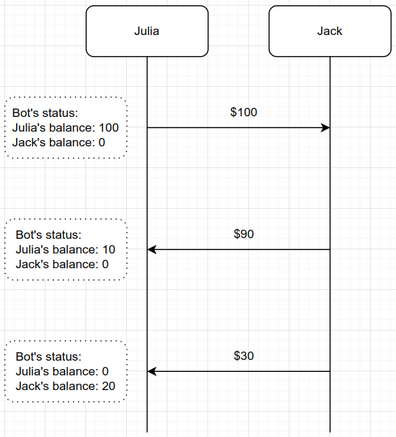

# Shared wallet Telegram bot
One may need to send/receive money to/from a friend or relative every once in a while. To do that, one would need to keep
an eye on the accounting of the transactions between herself and the friend, to know who owes whom, and how much.
This bot is an attempt to do the accounting of the shared wallet(s) between two persons.

## Notes:
* After running your instance of this bot, it will be private to the two persons whose chat IDs are configured in `volumes/cinfig.json`.  
* The bot can manage multiple wallets, e.g. Dollar, Euro, Pound, ... . This can be configured in `volumes/config.json`.

## Example:
Having `Julia` and `Jack` configured in `config.json`, the bot can keep the status of their balances:

## How to use
1. Clone the repository. 
2. Set the correct configuration in `volumes/config.json`. Hint: you can use `https://t.me/myidbot` to get your chat ID.
3. On the root directory of the project run `docker-compose up -d`.
