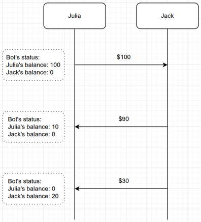

# Shared wallet Telegram bot
One may need to send/receive money from a friend or relative every once in a while. To do that one would need to have
an eye on the accounting of the transactions between herself and the friend, to know who owes whom, and how much.
This bot is an attempt to do the accounting of the shared wallet(s) between two persons.

The bot can manage multiple wallets, e.g. Dollar, Euro, Pound, ... . This can be configured in `config.json`.
## Example:
Having `Julia` and `Jack` configured in `config.json`, the bot can keep the status of their balances:

## How to use
1. Clone the repository.
2. Install the dependency `pip install python-telegram-bot`.
3. Both members of the bot (e.g. Jack and Julia) should know their Telegram chat_id. For example `https://t.me/myidbot` can give one her chat_id. 
4. Set the correct configuration in `config.json`.
5. Run `python3 main.py`.
